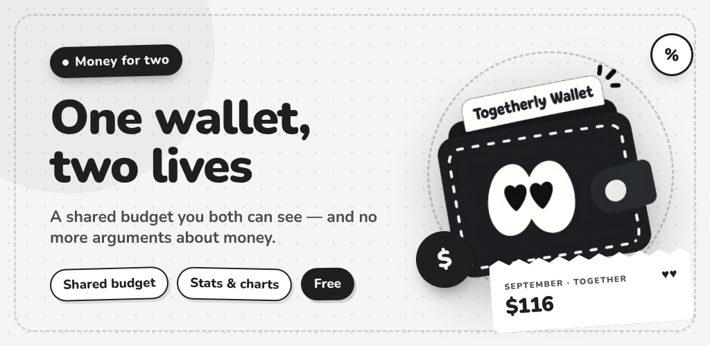

# Togetherly Wallet

[](https://github.com/THET1ME-1/Togetherly-Wallet/actions/workflows/ci.yml)
[](https://github.com/THET1ME-1/Togetherly-Wallet/actions/workflows/build.yml)
[](LICENSE)

[Русская версия](README.ru.md)

A money tracker built for two people. Two phones, one shared history, and a rule
that decides who sees what: the account. Money spent from a shared card shows up
for both partners. Money spent from a personal account stays private, and the
server never sends it to the other phone.

Wallet is part of the [Togetherly](https://togetherly.day) ecosystem and shares
its account, so signing in with your Togetherly credentials brings your partner
with you.



## What it does

**Accounts as cards.** Colour, payment network and last four digits, so you
recognise your own card at a glance. The full number is never asked for and
never stored.

**Split expenses.** Equal, by income share, or one payer covers it. Balances are
counted in cents, and the remainder goes to whoever paid, so the sum always adds
up to the operation.

**Budgets by agreement.** In a couple nobody rewrites a shared limit alone: one
proposes the amount, the other agrees. A budget can cover several categories at
once and count only the accounts you pick.

**Goals and debts.** Contributing to a goal is a transfer, not a number in a
form, so "saved" never drifts from what your wallets actually hold. Debts are
paid down by avalanche or snowball, and a payment that does not cover the
interest says so instead of drawing a comforting bar.

**Bank notifications, parsed on the phone (Android).** The app reads the
notification your bank posts and offers to record the expense. Parsing runs by
the shape of the text, not by a list of banks, and the text itself never leaves
the device.

**Talk to your money.** Ask a question, attach a receipt or a bank statement,
and the assistant records what you approve. Three questions a day are free.

**Seven languages.** Russian, English, German, French, Spanish, Italian,
Portuguese. Language is a device setting: your partner has their own phone.

## Build it

You need [Flutter](https://docs.flutter.dev/get-started/install) 3.35 or newer.

```bash
flutter pub get
flutter run                 # debug on a connected device
flutter build apk --release --split-per-abi
flutter build ios --release # macOS only
```

The release build signs with your own key when
`~/keys/wallet-key.properties` exists; without it Gradle falls back to the debug
key, so a fresh clone still builds. Firebase is optional too: drop
`android/app/google-services.json` in place and push notifications go through
FCM, leave it out and the app delivers them over its own live channel.

## Tests

```bash
flutter analyze
flutter test                # 819 checks
```

Screenshot tests need `sample-data.json` with real data and are skipped without
it. Everything else runs on a clean clone.

## How it is put together

| Folder | What lives there |
|---|---|
| `lib/data` | Models and the store: a JSON file, an outbox, delta merge |
| `lib/logic` | Pure calculations: splits, envelopes, goals, debts, parsing |
| `lib/screens` | Screens |
| `lib/widgets` | Shared parts: forms, sheets, cards, the design kit |
| `lib/l10n` | Dictionaries, one file per section, one column per language |
| `lib/design` | Palette, icons (MyNaUI), theme |
| `android` | Kotlin bridges: notifications, haptics, FCM |
| `ios` | The iOS project |
| `test` | 819 checks, including golden frames and 320 dp layouts |

The backend is not part of this repository. The app talks to
`https://togetherly.day/api/money/*`; if you fork Wallet, point `kApiBase` in
`lib/services/session.dart` at your own server.

## Design rules that are not negotiable

No shadows anywhere: depth comes from fill and a one-pixel border. Pure white
and pure black, zero colour temperature. Colour lives on money and on labels,
never on buttons. Dialogs in the centre of the screen do not exist. Everything
asks from the bottom sheet, because a button in the corner of a centred dialog
sits half a screen away from your thumb.

Tests guard these: `test/design_rules_test.dart` fails on a single `showDialog`,
on a shadow, and on a field label the theme would never show.

## Licence

GPL-3.0. Fork it, change it, ship it, and keep the source open.

The app icon and the Togetherly brand are not covered by the licence: they
belong to the project, and a fork needs its own name and its own icon.
