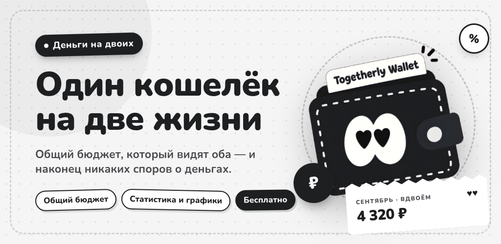

# Togetherly Wallet

[In English](README.md)

Трекер денег для двоих. Два телефона, одна общая история и правило, которое
решает, кто что видит: счёт. Списали с общей карты — видят оба, спорить не о
чем, иначе остаток врёт. Списали с личного счёта — не видит никто, и сервер
такую запись на второй телефон просто не отправляет.

Wallet живёт в экосистеме [Togetherly](https://togetherly.day) и делит с ней
учётную запись: вошли своей почтой — пара приехала вместе с вами.



## Что умеет

**Счета картами.** Цвет, платёжная система и четыре последних цифры — свою
карту вы узнаёте, не читая названия. Полный номер приложение не спрашивает и не
хранит.

**Дележ трат.** Поровну, по доле дохода или «только себе». Доли считаются в
копейках, остаток от деления достаётся плательщику, поэтому сумма долей всегда
сходится с суммой операции.

**Бюджеты договорённостью.** В паре никто не переписывает общий предел молча:
один предлагает сумму, второй соглашается. Бюджет может считать сразу несколько
категорий и только те счета, которые вы выбрали.

**Цели и долги.** Вклад в цель — это перевод, а не число в форме: «накоплено»
не разойдётся с остатками кошельков. Долги гасятся лавиной или снежным комом, а
платёж, который не перекрывает проценты, честно говорит, что так долг не
кончится.

**Уведомления банков разбираются на телефоне (Android).** Приложение читает пуш
и предлагает записать трату. Разбор идёт по форме текста, а не по списку банков,
и сам текст с устройства никуда не уезжает.

**Разговор о деньгах.** Спросите или пришлите чек и выписку — помощник запишет
то, что вы подтвердите. Три вопроса в сутки бесплатны.

**Семь языков.** Русский, английский, немецкий, французский, испанский,
итальянский, португальский. Язык — настройка устройства: у партнёра свой
телефон.

## Сборка

Нужен [Flutter](https://docs.flutter.dev/get-started/install) 3.35 или новее.

```bash
flutter pub get
flutter run                 # отладочная на подключённом устройстве
flutter build apk --release --split-per-abi
flutter build ios --release # только на macOS
```

Релиз подписывается вашим ключом, если есть `~/keys/wallet-key.properties`; без
файла Gradle берёт отладочный, и свежий клон всё равно собирается. Firebase
тоже необязателен: положите `android/app/google-services.json` — уведомления
пойдут через FCM, не положите — приложение доставит их своим живым каналом.

## Проверки

```bash
flutter analyze
flutter test                # 819 проверок
```

Снимки экранов рисуются настоящими данными из `sample-data.json`, а он лежит
вне репозитория — без него эти проверки пропускаются. Остальные проходят на
чистом клоне.

## Как устроено

| Папка | Что внутри |
|---|---|
| `lib/data` | Модели и хранилище: файл JSON, очередь отправки, слияние дельты |
| `lib/logic` | Чистые расчёты — доли, конверты, цели, долги, разбор уведомлений |
| `lib/screens` | Экраны |
| `lib/widgets` | Общие части: формы, листы, карточки, дизайн-система |
| `lib/l10n` | Словари разделами, язык — колонка, а не класс |
| `lib/design` | Палитра, значки (MyNaUI), тема |
| `android` | Мосты на Kotlin: уведомления, вибрация, FCM |
| `ios` | Проект iOS |
| `test` | 819 проверок, включая голдены и раскладку на 320 dp |

Сервера в этом репозитории нет. Приложение ходит в
`https://togetherly.day/api/money/*`; форку нужно указать свой адрес в
`kApiBase` — `lib/services/session.dart`.

## Правила оформления, которые не обсуждаются

Теней нет нигде: глубину даёт заливка и граница в пиксель. Ровно белый и ровно
чёрный, нулевая температура. Цвет живёт на деньгах и на метках, на кнопки не
заходит. Диалогов по центру экрана нет ни одного — спрашивает нижний лист,
потому что до кнопки в углу центрального окна палец тянется через полэкрана.

Это стерегут тесты: `design_rules_test.dart` краснеет на первом же `showDialog`,
на тени и на подписи поля, которую тема всё равно не покажет.

## Лицензия

GPL-3.0. Форкайте, меняйте, выкладывайте — и держите исходники открытыми.

Значок приложения и бренд Togetherly лицензией не покрыты: они принадлежат
проекту, и форку нужно своё имя со своим значком.
